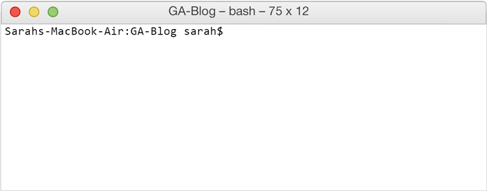
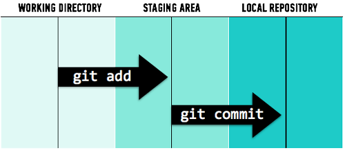

**WDI Fundamentals Unit 6**

---

## Get Started with Git

###Initialize a Repository

To turn an ordinary directory into a Git repository (or *repo* for short), you have to **initialize** the repository (this just means adding a hidden folder called `.git/` to your project folder, which contains all the data that Git needs to operate.

Simply change your working directory to the folder you'd like to track and run the command:

```
$ git init
```
> **CAUTION** Do not execute this command in your **home directory** –it will make it very difficult to work with any other repositories!

When you take a look at your working directory in the GUI you probably won't see any additional files, because (if you remember from Unit 1) hidden files are not visible by default on your computer.  To see the `.git/` directory you need to run `ls -a` from command line.

If you delete the hidden .git directory, you will effectively "uninitialize" your repository and you will lose the data Git collected for you.

> **CAUTION** You should never manually change the internal contents of your `.git` directory, unless your name is Linus Torvalds.

### Saving Changes to Your Project

Unfortunately, it's not enough to simply have your files in a repo. Like the terminal, Git doesn't make any assumptions about what changes you want to save or when you want to save them - you need to explicitly tell it what to do.

Suppose that we would like to work on a blog post for General Assembly, so we create a directory on our desktop called "GA-Blog" and run `git init` from inside that directory. At the moment, this project is empty - we can confirm this by running `git status`, which asks Git to give us an update on the status of our project.

```
$ git status
```

We should get a response like this.



Each 'save' that we make to our repository is called a **commit**; this message is telling us that our project has no unsaved changes.

Let's go ahead and make a new text file called `post.txt` inside of GA-Blog, using the `touch` command.

```
$ touch post.txt
```

Now let's check our Git status:


Git has identified that a change has been made - there is now a file in our repo. However, it does not know whether or not we want that change to be saved right now. To add this change to our next commit, we can run the command

```
$ git add post.txt
```
The changes we've just made have now been *staged*, added to the list of changes that will be officially saved with our next commit; however, this list is not final, and any of these changes can be taken off the list, or *unstaged*. If we run `git status` again, we'll see that the addition of `post.txt` is staged and ready to be committed:


> **NOTE** Often, you'll want to automatically save *any* changes that have been made inside your repo; instead of specifying a unique file, you can just write `git add .` - this will add all of the files in `.` (which, if you remember, is shorthand for the working directory) to the next commit.

Once we're ready to officially record this version of our project, we can type:

    $ git commit -m "created a new post.txt file"

The `-m` option allows you to include a message, describing the changes you made for your collaborators or future-you. These should be short but descriptive, clearly indicating what changes each commit makes to the project.

###The Git Staging Area

One of the unique features of Git is its "Staging Area".  Git allows you to add changes to your project to the local repo in two steps:

```
$ git add .
$ git commit -m "message"
```

Why stage? So that if you make multiple changes you can commit them separately or all at once (basically, it exists to help you better organize your project history).




### Your Commit History

When you're farther into your project, after a bunch of commits to your repository, you might want to look back and see a timeline of the changes you made. Git allows you to view a list of commits along with the date the commit was submitted, the author of the commit, the commit message AND a unique number to identify the commit by, called a SHA. This unique number allows Git to remember each commit, and apparently a 40-digit code is easier for Git than "Version1.txt" or "Draft-01-2014.txt".

To view the timeline of changes, you can run:

```
 $ git log
```

which will yield a list of entires that look like this:

```
commit 6d33f525a09b9918f75188db164ea2722039830b
Author: Sarah <sarah@gmail.com>
Date:   Wed Jan 28 17:44:03 2015 -0500

    added a new post

```

Each of these entries represents a commit for this project, and gives a lot of other useful information including when the commit was made, who made it, and (if the person wrote a good commit message) what that particular commit does.

---

[Here are some more exercises to help you practice.](04_exercise.md)
